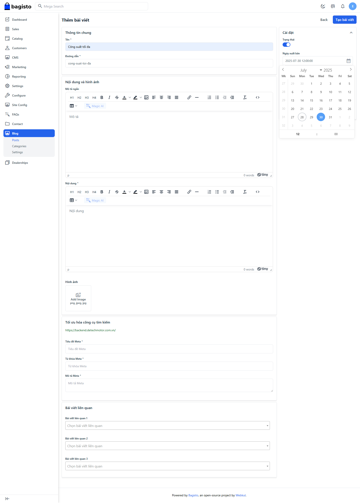

# Bài Viết

## Tạo/Chỉnh sửa

Vì bài viết sẽ có 2 ngôn ngữ chính là Việt và Anh nên khi tạo cần lưu ý

- Bấm nút tạo bài viết
- Điền thông tin bài viết cho ngôn ngữ Việt
- Mở lại bài viết để điền tiếng Anh

