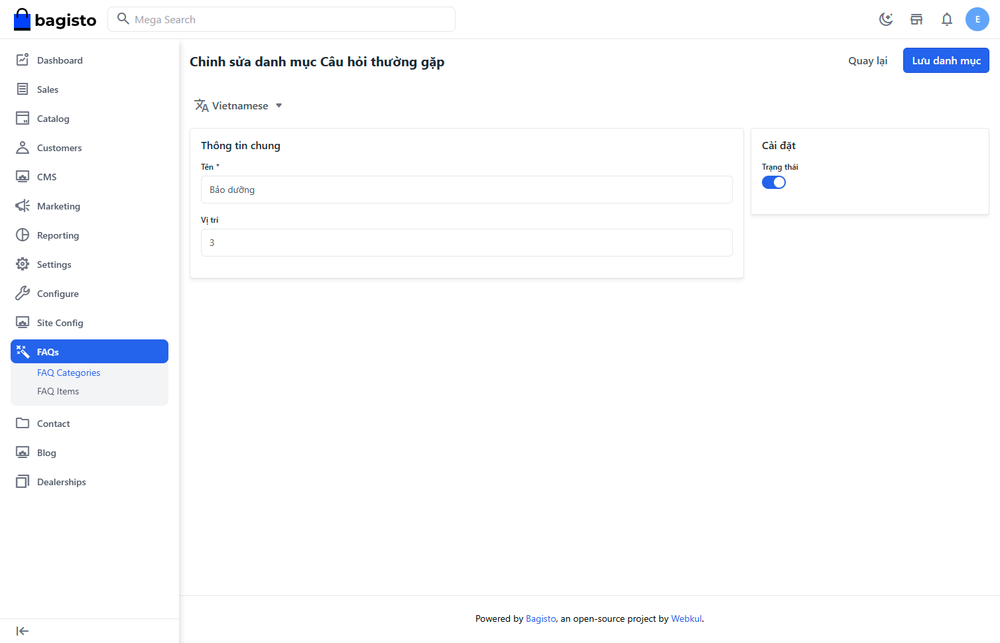

# Danh mục câu hỏi

## Tạo/Chỉnh sửa

Vì danh mục hỗ trợ tiếng Việt và Anh nên khi tạo cần lưu ý

- Bấm nút tạo danh mục
- Điền thông tin danh mục cho ngôn ngữ Việt
- Mở lại danh mục để điền tiếng Anh

