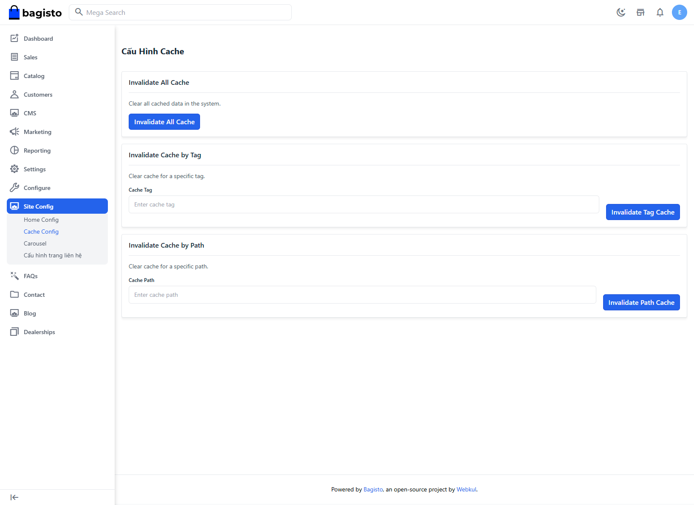

# Quản lí cache của frontend

- Thông thường sau khi edit sản phẩm hoặc bài viết hệ thống sẽ tự động cập nhật

- Những trường hợp cần thiết phải thực hiện thủ công:
- Sửa cấu hình thuộc tính của sản phẩm
- Hệ thống lỗi khi cập nhật sau khi sửa sản phẩm/bài viết

## Thực hiện xóa cache
- Bấm vào nút **Invalidate All Cache** trong hình dưới để thực hiện cập nhật cho toàn bộ trang
- Hai lựa chọn Invalidate Cache by Tag hoặc Path tiếp theo dành cho những tình huống nâng cao
- **Invalidate All Cache** đã bao gồm tất cả các trang cho nên không cần thiết phải sử dụng cập nhật cache nâng cao

