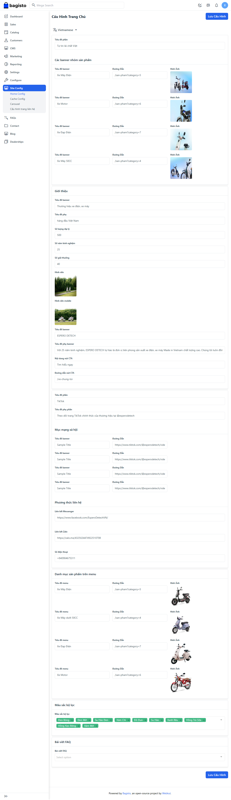
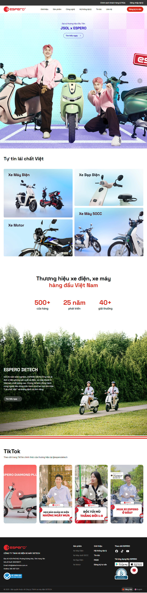

# Cấu hình thông tin trang chủ

Lưu ý khi cấu hình đa ngôn ngữ:
- Việc đổi ngôn ngữ sẽ tải lại trang, nếu muốn đổi ngôn ngữ cấu hình thì phải lưu lại thay đổi trước. Sau đó mở lại trang và chọn ngôn ngữ mới

- Mục các slides sẽ ở phần riêng

## Các mục chính

- Tiêu đề phần Danh mục
- Banner danh mục sản phẩm
- Các cấu hình phần Giới thiệu
- Tiêu đề phần Social
- Phương thức liên hệ
- Danh mục sp trên menu sổ
- Các màu sắc trong bộ lọc ở trang sản phẩm
- Chọn bài viết FAQ (tối đa 2 bài blog)

## Kết quả

